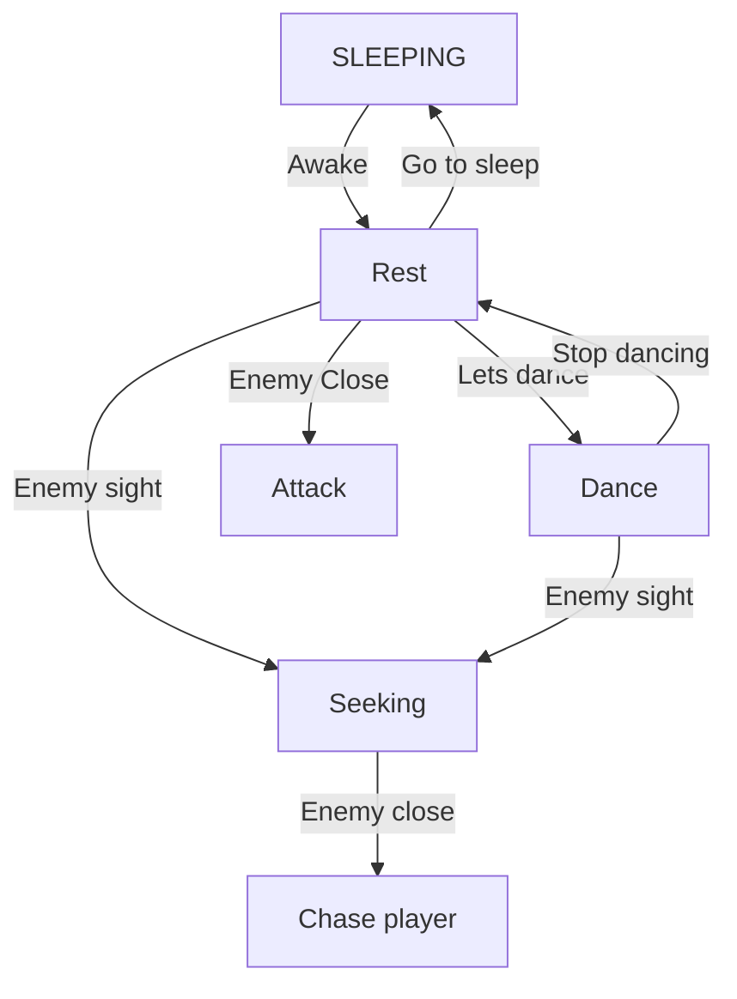

```mermaid
flowchart
S[SLEEPING] -->|Awake| R[REST]
R --> | Go to sleep | S
R --> |Enemy sight| SE
R[Rest] --> | Lets dance | D[Dance] 
R[Rest] --> |Enemy Close| ATA[Attack]
D --> |Stop dancing| R
D --> |Enemy sight| SE[Seeking]
SE --> | Enemy close | CP[Chase player]

```

