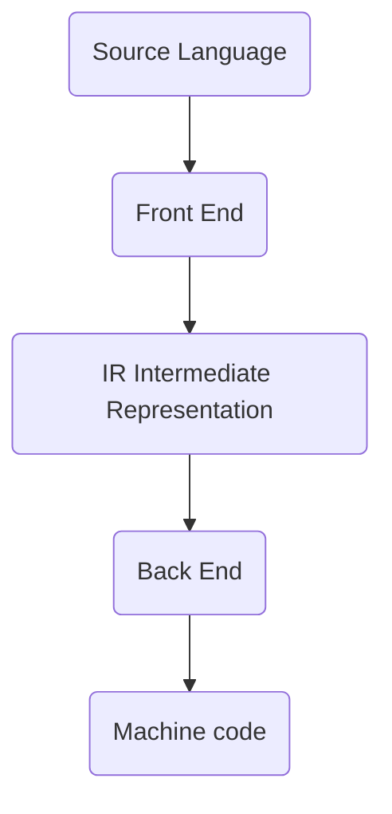
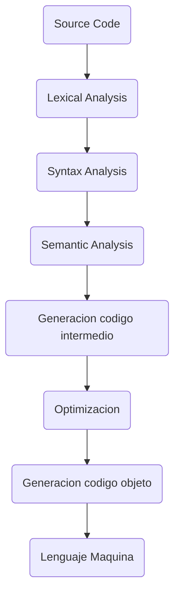

#CONCEPTS 

### Definition

A compiler is a program that translates from a source code written in a high level language in an equivalent low level code, that can be executed directly by a device. 

They allow to code independently from the machine. Also generates correct code, that can be reviewed though a list of errors to spell-checking and other features. 

### Compiler phases

The compiler is composed of various phases or components and each one of them realizes a certain sub-tasks of the compilation. 

This decomposition reduces its complexity and makes easy each tasks implementation. 
Also each part can be implemented independently by different people, maximizing the optimization in time spent. 

Also can reuse source code. 

The compiler can be divided in two parts Front End and Back End. 

Because is splitted into this two parts, can be interchanged in order to produce multiple compatibilities. 

Onc the front end for Java and backend for Intel i7 has been built, it only need a new back-end to be able to compile in other CPU or even build a C compiler only writing the Front End part. 

The steps a compiler does is: 

`FRONT END`

* `Lexical Analysis`:  An scanner recognized the input characters and recognizes and build tokens from it. 

* `Syntax Analysis`: (Parser) Takes tokens from the lexical analysis and analyze them using grammars [[GRAMMARS - Introduction]]. Using this grammars, it construct a AST (Abstract Syntax Tree) that define the tokens traverse. In general, group tokens into phrases with meaning. 

* `Semantic Analysis`: This steps receives the AST from the Syntax Analysis step, check on errors and complements the AST with certain add-ons generating a Anotted AST. 
	* Declare names in a symbol table
	* Search names between its references to determine types
	* Assign types to expressions
	* Check types validity

 * `Intermediate code generation`: This step generates device independent assembler code that can process the sentences defined in the AST with notes. Generates a Three-access code (three operand sentence code) also called RTL or Register Transfer Language. This assembler language is free of device context like registers or certain operations. (Its based in virtual registers)

![[./IMAGES/lexic-and-syntax-analysis.png]]

`BACK END`

* `Optimization`: Optional phase that optimizes the thousands of assembler code generates in the previous step. 

* `Object Code Generation`: Translation of the assembler code model into target's architecture machine code of the device, using an appropriate instruction set. 

* `Machine Code`: 

The object code or machine code resultant is not totally executable, because contains calls to OS functions and the linker completes this call with libraries referenced.  

### COMPILERS JUST-IN-TIME

Compilers just-in-time are compilers in execution time or dynamic translation. 
Its like an hybrid of static compilation and interpretation and its purpose is to improve execution of certain programs. 

In systems that compile into bytecode an interpreter is needed to make the program to work, translating this bytecode into executable code. 

JIT compilers, in certain parts of the code in bytecode that can be executed multiple times constantly, are cached. So when this code is called again, doesn't need to be translated again, and 

### PEEPHOLE OPTIMIZATION

Its an optimization technique executed over a small part of the set of instructions of the generated code. 

This technique works recognizing set of common instructions that can be replaced with shorter or more optimized ones.   

### SYMBOLS TABLE

Its a data structure used by the compilers where each identifier in the source code is linked with information about its declaration or format in the source code. 

This attributes are code-dependant but are like: 

* Name of identifier
* Type of identifier
* Memory address allocated if its a variable
* Maximum size of the array 
* etc

