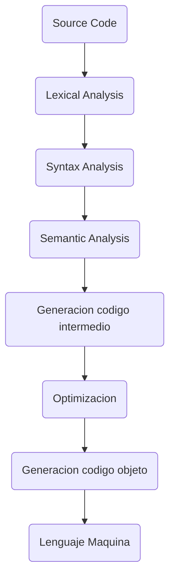

#CONCEPTS 

### Definition

A compiler is a program that translates from a source code written in a high level language in an equivalent low level code, that can be executed directly by a device. 

The steps a compiler does is: 

* `Syntax Analysis`: Takes tokens from the lexical analysis and analyze them using grammars [[GRAMMARS - Introduction]]. Using this grammars, it construct a AST (Abstract Syntax Tree) that define the tokens traverse. 
* `Semantic Analysis`: This steps receives the AST from the Syntax Analysis step and complements the AST with certain add-ons. 
* `Intermediate code generation`: This step generates assembler code that can process the sentences defined in the AST with notes. 
* `Optimization`: Optimizes the thousands of assembler code generates in the previous step. 
* `Object Code Generation`: Translation of the assembler code model into target's architecture machine code of the device, using an appropriate instruction set. 
* `Machine Code`: 