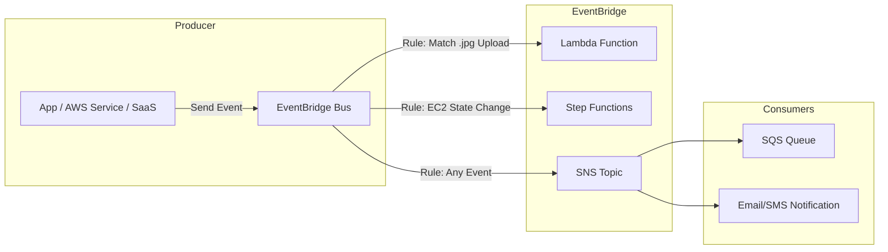

#AWS 

# AWS - Event Bridge

**EventBridge** is a **serverless event bus service** that makes it easy to connect applications using events.

It helps build **event-driven architectures** by routing events from AWS services, SaaS apps, or custom applications to targets like Lambda, Step Functions, SNS, SQS, Kinesis, etc.

    
- It’s basically the evolution of **CloudWatch Events** with added features like schemas, partner integrations, and custom event buses.

It can also be used together with SNS topics and then the SNS will distribute the events to multiple subscribers (SQS, lambda, HTTP endpoints, emails or more)

Together with SQS to buffer and retry the event response of the consumers like lambda or EC2 process them. 

### Scheduled events

EventBridge can also run **cron jobs** or scheduled events.

Example question can be: *A company needs to run a Lambda function every day at 2 a.m. Which service should they use?*

# Integrations

It can be integrated to respond under events from different AWS resources: 
* S3 object creation / deletion
* ACM AWS Certificate Manager can send an event to Event Bridge for managing certificate lifecycle changes like Approaching expiration, certificate expired or certificate renewed. 

### When its used

EventBridge is normally used when you need:
- To respond to **events** (e.g., S3 object created, EC2 state change, CodePipeline execution).
- **Pattern-based filtering** (not all consumers get the event, only matching ones).     
- **Multiple targets** from the same event.
- **Scheduled events** at certain hours or at a period.  

Its not related with messaging, as SNS/SQS are used more for simple messaging/queuing (pub/sub or decoupling microservices).

### When its not used

When the messages needs to last or need more than 1 retry or the event needs to be buffered, its more likely to use an SQS. 
When the events consists on long workflows or orchestration or more than one AWS resource, Step functions are used, not Event Bridge. 

### Example

*A company wants to trigger a Lambda function when an object is uploaded to S3, but only if the object has a `.jpg` extension. Which service should be used?*

or 

*A company uses a SaaS application that emits user activity events. They want to process these in AWS with minimal setup. Which service should they use?* 