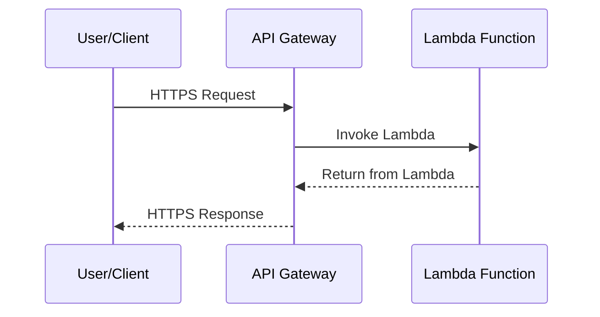

#AWS 

# Lambda 

AWS Lambda is a serverless compute service that lets you run code without thinking in the servers. 

Serverless computing lets abstract the infrastructure in the cloud from the code that its executed. 

### Use cases

Lambda is commonly used for scenarios where the application need to scale up rapidly and scale down to zero when there is no demand. 

This can be used for example for: 

* <span style="color:DodgerBlue;">file processing</span>: use an Amazon S3[^s3] that triggers a lambda data processing after each upload. 
* <span style="color:DodgerBlue;">Stream processing</span>: using lambda and Amazon Kinesis, it can process real-time streaming data for application activity tracking, transaction order processing, log filtering, social media analysis, telemetry. 
* <span style="color:DodgerBlue;">Web applications</span>: Combined with other AWS services to build highly scalable web applications. 
* <span style="color:DodgerBlue;">IoT backends</span> build serverless backends to handle web, mobile, IoT and third parties API requests.
* <span style="color:DodgerBlue;">Mobile backends</span>: build backends with Lambda and API gateway to authenticate and process API requests and integrate with iOS, Android, Web and react using AWS Amplify[^amp]

You only pay for the compute time that its used. 


---
# Lambda Concurrency

**Concurrency** its when various Lambda instances are running simultaneously at any given moment, like for spike traffic.

Lambda has a concurrency limit of 1000 concurrent executions per AWS Account per region. ( Can be expanded via **AWS Support**).

It has two types of concurrency: 

* **Reserved concurrency**: Guarantee an specific number of concurrent executions for a certain Lambda function (Limited to that number).
	* Functions cannot exceed that specific number
	* Functions always has access to that reserved amount
	* The reserved quantity is substracted from the AWS Account's Lambda limit, so other executions has the leftover.
	* *Use cases*: 
		* protect critical functions so won't be affected by other non-critical functions execution. 
		* Special case is to set `reserved concurrency` to 0 in order to disable a lambda function to be executed. 
* **Provisioned concurrency**: its like pre-warming an specific amount of Lambda executions so they are ready to respond immediately (No cold starts of an execution)
	* Eliminates cold starts
	* Code is loaded and libraries are installed. 
	* Can exceed provisioned capacity.
	* You **pay for the provisioned capacity** even if its unused.
	* Works with `reserved concurrency` but in that case, cannot provision more than the Reserved amount. 

---
## Lambda networking and VPC Configuration

An AWS Lambda by default doesn't get attached as a VPC's resource, as being serverless it gets the following networking model: 

* Ephemeral IP: gets an public IP but its managed by AWS and its invisible for you. 
	* Public IP
	* Changes constantly in each invocation
	* Its not predictable
	* Allows the lambda to make outbound HTTPs requests and call other S3 services. 

To connect to VPC's private resources you can set VPC Networking in the lambda configuration for: 
* Private IP from the VPC subnet
	* ENI or Elastic Network Interface created in the subnet with an IP taken from the subnet pool CIDR. 
	* Can be restricted by the subnet's network security group rules. 

Has some limitations: 
* IP changes on each invocation so cannot be addressable via static IP hardcoding. 
* Cannot assign manually an static IP. 
* Shares the ENIs between multiple invocations. 
	* This is called **Hyperplane**, allowing minimal cold start impact and pre-warmed connections. 
* Requires a NAT in order to update itself. 

> Note: Take into account that with VPC networking configured, **all** the outbound traffic will go through the subnet's ENI, so without a NAT, the lambda won't be able to access public internet or call external APIs. 

---
## How to send API Requests to Lambda while its executing

Lambda accepts "requests to trigger" an Lambda execution but, what about inbound requests to an Lambda execution?

Lambda its not like EC2 for example: 
* Has not listening ports
	* Won't allow inbound network connections
* Has no SSH access
* No persistent network socket. 

Lambda its triggered by an event: 
* Triggered by an event like API Gateway, Event Bridge, SQS, S3 and others
* Process the event
* Returns a response
* Terminates

So the most common way to expose a Lambda to be triggered by an HTTP / HTTPS request is use an API Gateway: 



### Lambda Function URLs

A relatively new feature is **Lambda function URLs** that make able to directly execute a lambda with an HTTPS endpoint request without configuring an API Gateway. 

**Lambda function URL** its a built-in HTTPs endpoint that can be enabled in a Lambda function to invoke it directly via an HTTPS request. 

It created a endpoint with an FQDN like this: 
```bash
https://<unique-id>.lambda-url.<region>.on.aws/
# Example
https://dasnk123def456.lambda-url.us-east-1.on.aws/
```

>Note: It has no cost, just the lambda execution charges, has a dedicated URL per function and supports up to 20 MB streaming response with methods like GET, POST, PUT and DELETE.

Its only recommendable for simple APIs, webhooks or internal tools as cannot be protected by a WAF, caching response, request throttling or rate limiting features.


[^s3]: Amazon Simple Storage Service or S3 [[AWS - S3]]
[^amp]: Amazon Web Services Amplify service [[AWS - Amplify]]