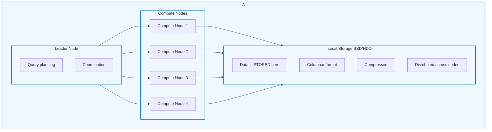

#AWS

# AWS - Redshift

**Amazon Redshift** is a fully managed data warehouse for analytics at a high scale. 
It uses a columnar storage and a massively parallel processing (MPP) to run fast SQL queries on large datasets. 

It can run in provisioned clusters or serverless mode with features like: 
* Data compresion
* Materialized views
* Result Catching
* Data Sharing
* Federated queries to RDS, Aurora or S3 data lakes. 

It exposes an Redshift Data API that allow to query Redshift to: 
* Query Redshift without using JDBC / ODBC drivers. 
* Resftull api to run SQL queries
* Supports various applications types. 
* BI dashboards can query Redshift. 

Key features: 

* Allows **Server Side encryption** (Encryption at rest) and **Client Side encryption** (Encryption in transit) both with AWS managed keys, Customer managed KMS Keys and hardware security module or HSM keys
* Redshift is optimized for complex queries, not high request rates. 
	* Its a single-region service
	* Cannot span multiple regions natively and its not replicated or scaled. 

Take into account that Redshift is not a cache-layer between a querying party and a data lake like S3, it stores the data on disk in a columnar format. 

# Redshift Architecture

It uses **Redshift Architecture** where a **Leader** node parses and optimizes the queries and dispatch the work to compute nodes that process the columnar data in parallel. 

This architecture is meant to run complex queries over high volume data. 

## Integrations

Redshift has integrations with: 
* Query data from S3[^1] lakehouse
* Federated queries to Aurora[^2] or RDS[^3].

[^1]: S3 or Simple Storage Solution its a general object storage fully managed solution by AWS [[AWS - S3]].
[^2]: Aurora DB [[AWS - Aurora]]
[^3]: AWS RDS or Relational Data Base