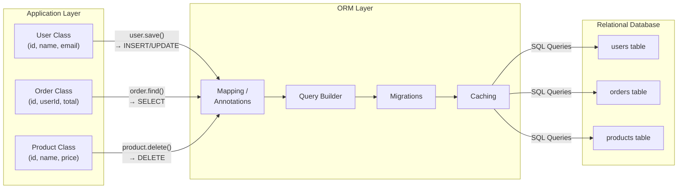

#BACKEND

# ORM or Object Relational Mapping

**ORM** or **Object Relational Mapping** is a technique used normally in Backend technologies [^1] to map or convert the data represented in object-oriented programming[[Object Oriented vs Data Oriented]] and relational databases. 

It creates a relation between classes's objects and the database tables letting the data use programming language syntax instead of raw SQL[[SQL - Introduction]] queries. 

This relation handles the CRUD (Create, Read, Update and Delete)[^2] operations automatically when modifying the classes. 

## How it works

1. Defines the mappings between the objects models (Classes) and the databases schemas. 
2. Translate method calls like for example `user.save()` into SQL queries that update the DB. 
3. Supports relationships like one-to-many using annotations and configurations
4. Offer other features like query builders, migrations and caching. 

## Benefits

The main benefit of using an ORM in backend development is to improve the productivity in the development as boilerplate code like SQL queries is automatically handled and improve security like preventing SQL injection. 

[^1]: Backend Development [[Backend]]
[^2]: CRUD or Create, Read, Update and Delete [[CRUD - Create, Read, Update and Delete]]