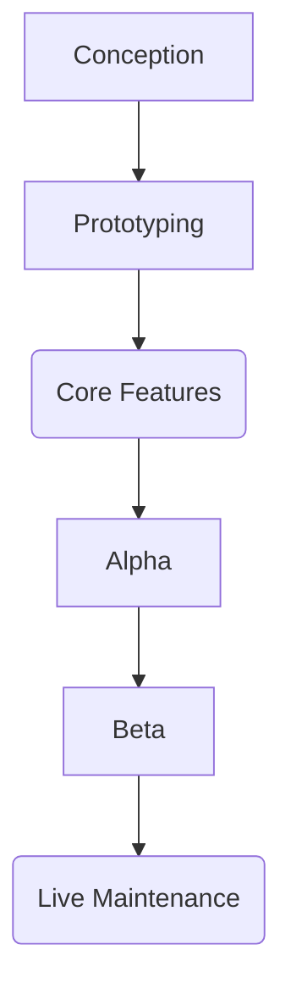

#GAMEPRODUCTION

### Game production roadmap

-----PITCH APPROVED-----

* `Conception`: Define the game characteristics and details after the game pitch has been approved. 
	* Initial GDD & narrative blueprint
	* Visual style guide and Art Bible [^2]
	* Documentation creation
	* Analyzing the game's place in the market
	* Narrative beats and structure

* `Prototyping`: Test the viability (fun, tech, etc). The team is testing the game viability via small, theme-focused prototypes
	* Paper prototypes and proof of concepts

-----VIABILITY CONFIRMED-----

* `Core features`: (6 - 18months) Develop the main systems of the game. 
	* Game loop implementes

* `Alpha`: Adding extra content to the game and fill the structure and systems implementes with more content. 
	* Implementing final UX flow
	* Writing final dialogue
	* Creating final level and mission design
	* Polishing and tuning balancing via play-testing and QA

* `Beta`: Polishing and bug fixing before the code gets `freeze`. Needs to pass the compliance. Only repair game, don't add new features. 
	* Complete localization [^1] in all languages
	* Certification and compliance tests (TRCs) 

-----GOLD-----

* `Live maintenance`: Once the game has been released
	* Start working on the day 1 Patch
	* Planning on future IP installments

---

Keywords: 

[^1]: Localization: Not only take into account translation, but also take into account that if the game is correctly adapted for the intended country and age in that country. 

[^2]: Art bible: references of how the game is going to look 

