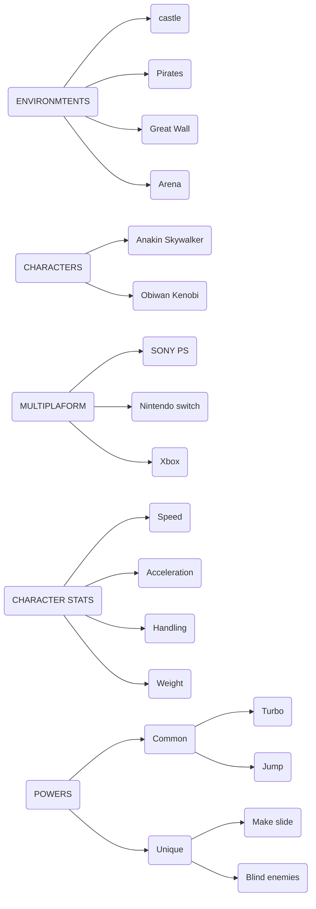

#GAMEPRODUCTION 

Scope is a definition of the variables or limits that the game would have: 

We need to define at least: 

* Environments: Define the different map zones that are involved in the story or the game
* Characters: Define the characters in a simpler form, only name and few so. 
* Character stats: statistics to take into consideration of each player, like health, speed, acceleration, etc
* Multiplaform : define all platforms that the game would be ported for
* Powers: Different mechanics involved in the game differenciated if they are unique for a player or common. 

We need to define in which game development state needs to be completed each scope feature.

At least mark the features that need to have the game to be considered that is a showable version, a vertical slice or a demo. 

The game production phase can be in different states: 

* Not started
* Inception
* 

