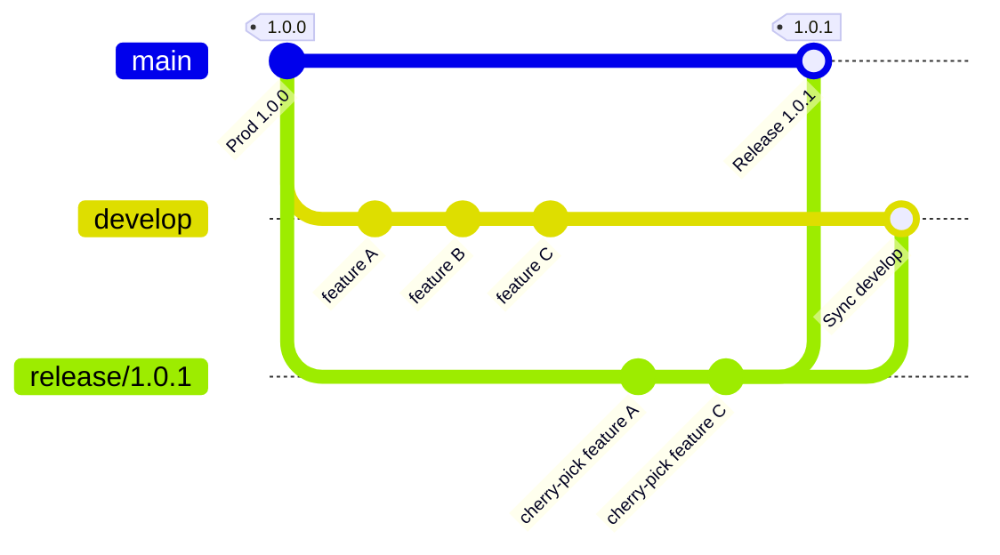
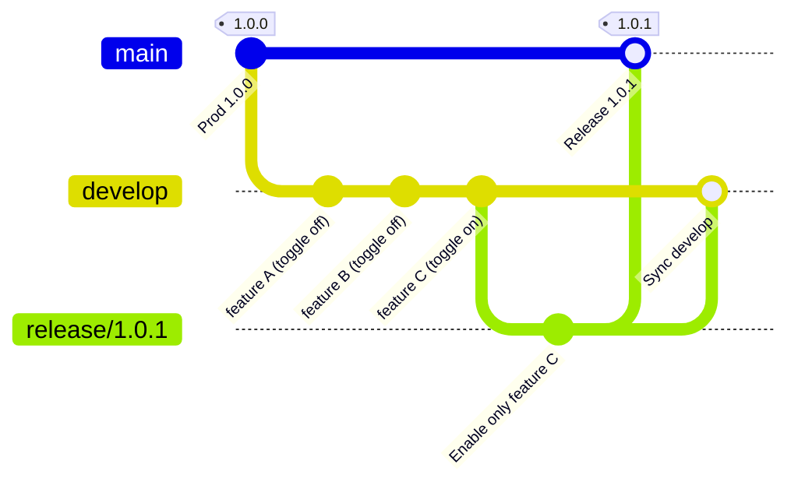
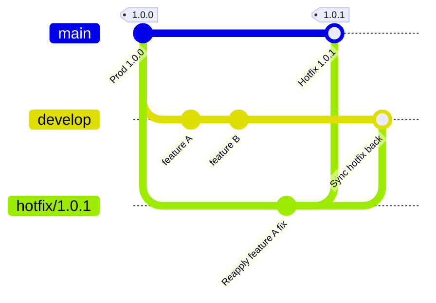
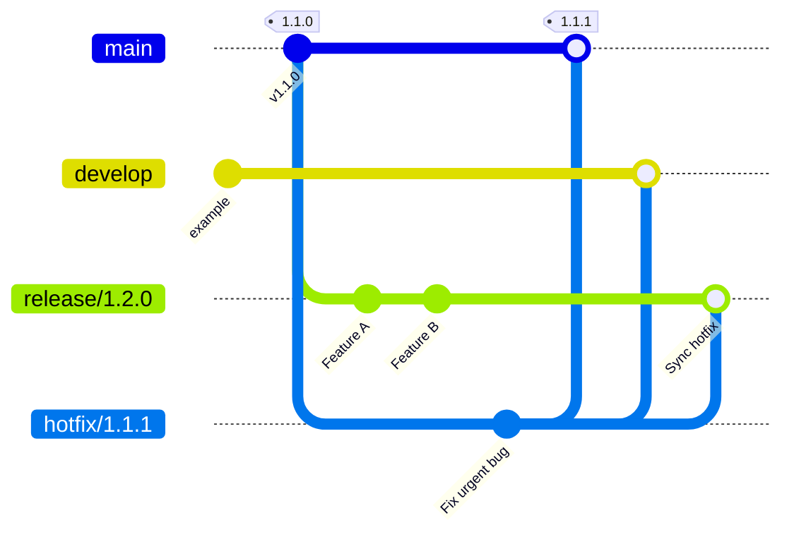

# GIT

# GITFLOW - Advanced Use Cases

This is a guide with several advanced use cases for working with GitFlow to promote changes to production without blocking ongoing feature development or other teams' work.

Considering the standard GitFlow branches:

- `develop`: integration branch
- `feature/*`: branches for developing features
- `release/*`: preparation branch for a new production release
- `hotfix/*`: urgent production bugfix branches
- `main`: production branch

The main problem this guide tries to solve is that when you need to promote a subset of changes that are in `develop`, you cannot do a simple merge from `develop` -> `release` because all commits in `develop` would be included in the release.

## Strategy 1: Controlled cherry-pick into a release

Use this strategy when there are multiple features or commits in `develop` and you need to promote only some of them to production.

In this strategy you do not perform a full merge of `develop`.

Steps:

1. Identify the commits or PRs that must be promoted to production.
2. Create a branch `release/X.Y.Z` following Semantic Versioning from `main` or the last stable release.
3. Cherry-pick the specific commits from `develop` that are not in `main` and that you want to take to production.
4. Merge `release/X.Y.Z` into `main` to deploy to production.
5. Merge `release/X.Y.Z` back into `develop` to keep things in sync.



Advantages: this option does not block `develop` and gives you full control over which commits are promoted.
Be aware that cherry-picking can create conflicts if a feature is tightly integrated with other changes.

It's recommended to keep good traceability by using clean PRs per feature.

## Strategy 2: Feature toggle + partial merge

By using **feature flags** or **code toggles** (see the Feature Toggles section), you can:

1. Merge the entire `develop` branch into `release`.
2. Enable only the desired features.
3. Deploy to production.
4. Keep undesired features disabled until they are ready.



This option requires implementing `release flags` in the code, which can add infrastructure and testing overhead.

## Strategy 3: Hotfix from develop

If a commit is urgent to fix functionality currently in production, you can treat the change as a `hotfix`.

This strategy is recommended when the changes you want to promote are already integrated in `develop` and cherry-picking is not viable because they depend on other commits.

- Create a `hotfix/x.y.z` branch from `main`.
- Cherry-pick the minimal commits needed, or reapply the fix manually on that branch.
- Merge `hotfix` -> `develop` to keep consistency.
- Deploy to production.



If the hotfix branch's functionality has been applied correctly, merging it into `develop` should not change already implemented functionality, or it should correct it.

This strategy allows a fast update without "freezing" `develop` and is useful for urgent deployments.

Be careful not to duplicate logic already implemented in `develop`; replicate changes consistently with what is already present in that branch.

## Strategy 4: Hotfix against an active release

If a `release` is being prepared while you also need to fix a bug or apply an urgent change to production, you can perform a `hotfix` against the active release:

1. Create a `hotfix/*` branch from `main`.
2. Apply the new changes via cherry-pick or manual implementation.
3. Merge to `main` and deploy the fix to production.
4. Merge to `develop` and also to the active `release/X.Y.Z` branch to keep everything in sync.



# Feature Toggles

A **feature toggle** (feature flag) is a setting that allows enabling or disabling functionality at runtime without deploying a new release.

You can have the code for feature X in production but keep it inactive, then enable it later with a configuration change.

An example in `appsettings.json` or `web.config`:

```json
{
  "FeatureToggles": {
	"EnableNewDashboard": true,
	"EnablePaymentGateway": false
  }
}
```

A service to read toggles:
```csharp
public interface IFeatureToggleService
{
	bool IsFeatureEnabled(string featureName);
}

public class FeatureToggleService : IFeatureToggleService
{
	private readonly IConfiguration _configuration;

	public FeatureToggleService(IConfiguration configuration)
	{
		_configuration = configuration;
	}

	public bool IsFeatureEnabled(string featureName)
	{
		return _configuration.GetValue<bool>($"FeatureToggles:{featureName}");
	}
}
```

And conditionally enable functionality when the toggle is active:
```csharp
[ApiController]
[Route("api/[controller]")]
public class DashboardController : ControllerBase
{
	private readonly IFeatureToggleService _featureToggleService;

	public DashboardController(IFeatureToggleService featureToggleService)
	{
		_featureToggleService = featureToggleService;
	}

	[HttpGet("new-dashboard")]
	public IActionResult GetNewDashboard()
	{
		if (!_featureToggleService.IsFeatureEnabled("EnableNewDashboard"))
		{
			return Forbid(); // or NotFound(), as appropriate
		}

		return Ok(new { message = "New dashboard enabled" });
	}
}

```

You can also implement feature management using Microsoft's library: `Microsoft.FeatureManagement`.

# Useful commands

To perform cherry-pick via the CLI:
```bash
git checkout <target-branch>
git cherry-pick -x <commit-hash>
```

To view commit hashes:
```bash
git log --oneline
# or
git log
```
