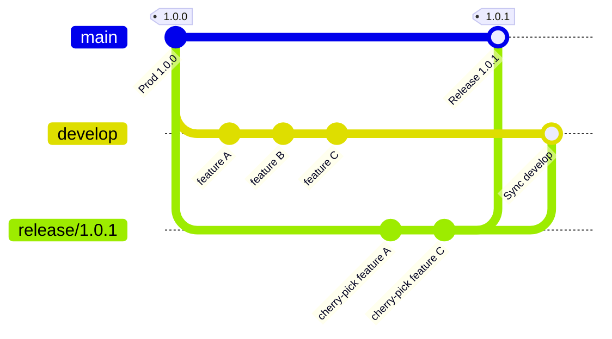
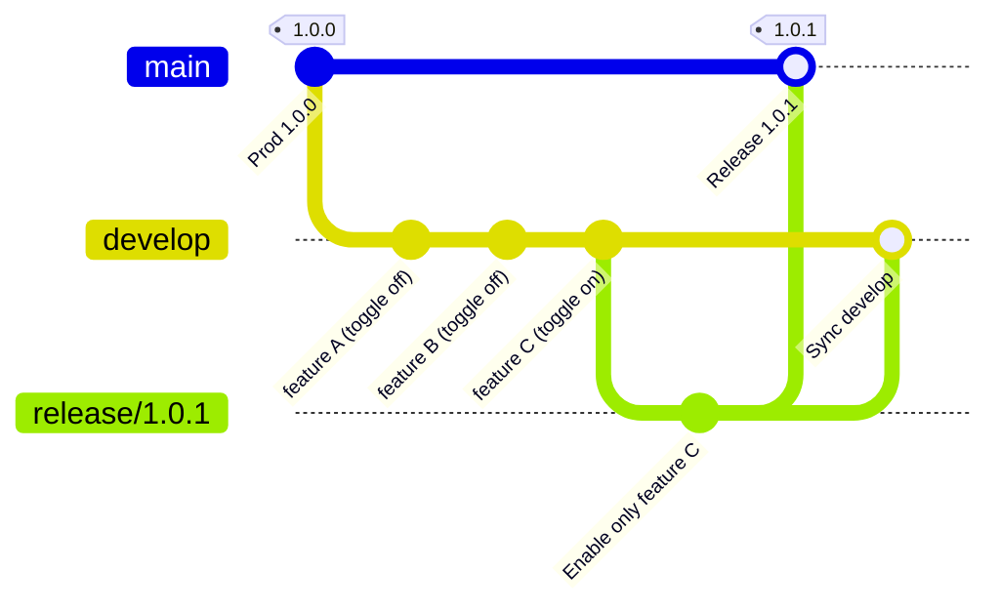
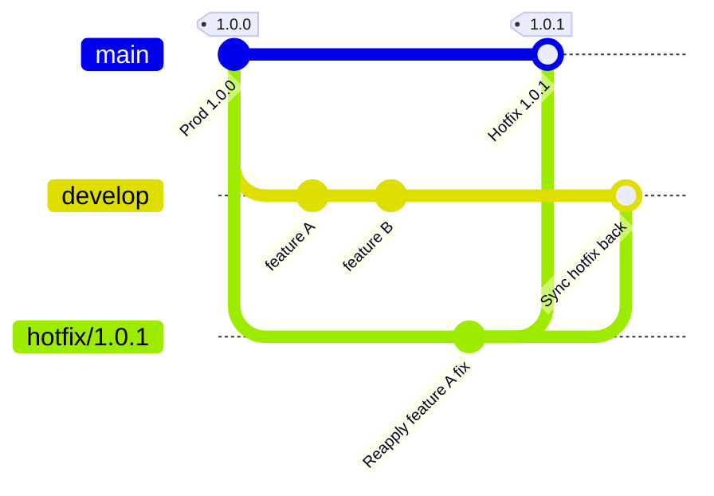
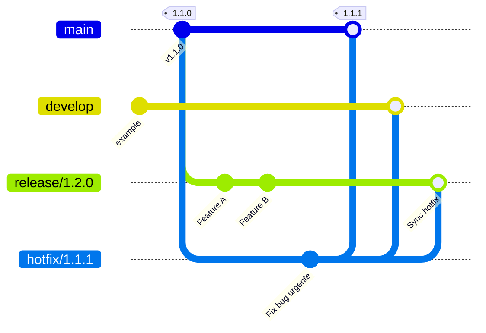

#GIT 

# GITFLOW - Casos de uso avanzados

Esta es una guía de varios casos de uso avanzados para trabajar con GitFlow para trabajar y llevar cambios hasta producción sin bloquear el desarrollo evolutivo de la aplicación o el trabajo de otros equipos. 

Teniendo en cuenta el flujo y ramas de GitFlow estándar: 

* `develop`: rama de integración
* `feature/*`: ramas de desarrollo de funcionalidades. 
* `release/*`: preparación de nueva versión para subir a producción. 
* `hotfix/*`: corrección de errores urgentes en producción. 
* `main`: rama de producción. 

La problemática principal que intenta resolver esta guía es que cuando se necesita subir un **subconjunto de cambios** presentes en `develop` no se puede realizar un simple *merge* de `develop`->`release` ya que todos los commits de `develop` se incorporarían a producción. 


## Estrategia 1: Cherry-pick controlado en una release

Esta estrategia de debe usar cuando hay varios features o commits en `develop` y se necesita **subir únicamente algunos a producción**. 

En esta estrategia no se hace un merge completo de `develop`. 


Pasos a realizar: 
1. Identificar los commits o PRs que se deben subir a producción. 
2. Crear una rama `release/X.Y.Z` siguiendo SemanticVer desde main o última version estable. 
3. Realizar **cherry picking** de los commits específicos de `develop`, que no estan en `main` y que se quieren llevar a producción. 
4. Hacer merge de `release/X.Y.Z` a `main` para subir a producción. 
5. Hacer merge de `release/X.Y.Z` a `develop` para mantener sincronizado. 



Ventajas de esta opción es que no se bloquea `develop` y se tiene control total de los commits que se suben. 
Hay que tener en cuenta que el cherry picking puede generar conflictos si el feature esta fuertemente integrado con otros cambios. 

Recomendable mantener buena trazabilidad de los cambios usando PRs limpios por feature. 

## Estrategia 2: Feature toggle + merge parcial

Trabajando con **feature flags** o **toggleo de código** (Mirar sección de feature toggles) se puede realizar: 

1. Merge de `develop` completo a `release`. 
2. Activar solo las features deseadas. 
3. Desplegar a producción. 
4. Desactivar flags de la feature no deseadas hasta que estén listas. 




Esta opción require implementar en el código **flags de releases** lo que puede suponer una mayor infraestructura y testing de la aplicación. 

## Estrategia 3: Hotfix desde develop

Si el commit es urgente para solucionar alguna funcionalidad actual de producción, siempre se puede tratar este cambio como un `hotfix`. 

Esta estrategia es recomendable si los cambios que quieres subir ya están integrados en `develop` y no es viable cherry-pick porque depende de otros commits. 

- Crear una rama `hotfix/x.y.z` desde `main`.
- Cherry-pick de los mínimos commits necesarios o incluso reaplicar la funcionalidad a mano en esa rama.
- Merge `hotfix` → `develop` para mantener consistencia.
- Subir a producción.




Si la funcionalidad de la rama `hotfix` se ha aplicado correctamente, al realizar el merge con `develop` no debería cambiar la funcionalidad ya implementada o esta debería estar corregida. 

Esta estrategia permite actual rapido sin "congelar" `develop` y es util para implementaciones urgentes. 

Tener cuidado con duplicar la lógica ya implementada en `develop`, replicar de manera consistente con lo ya implementado en esta rama. 

## Estrategia 4: Hotfix sobre release activa

En el caso de que se este preparando una `release` a la vez que se necesita realizar la reparación de un bug o una implementación urgente sobre producción, se puede realizar un `hotfix` sobre la release activa: 

1. Crear rama `hotfix/*` desde `main`. 
2. Aplicar cambios nuevos realizando cherry picking o implementación manual. 
3. Merge a `main`y deploy de la misma a producción. 
4. Merge a `develop` y también a la rama `release/X.Y.Z` que esta activa para mantener sincronía.



# Feature Toggles

Un **feature toggle** es una flag que permite activar o desactivar una funcionalidad en tiempo de ejecución sin tener que desplegar una nueva versión. 

Se puede tener el código de la feature X en producción pero estar inactivo y activarlo  más tarde con un simple cambio de configuración. 

Un ejemplo seria, en `appsettings.json` o `web.config`: 

```json
{
  "FeatureToggles": {
    "EnableNewDashboard": true,
    "EnablePaymentGateway": false
  }
}
```

Un servicio para leer los toggles: 
```csharp
public interface IFeatureToggleService
{
    bool IsFeatureEnabled(string featureName);
}

public class FeatureToggleService : IFeatureToggleService
{
    private readonly IConfiguration _configuration;

    public FeatureToggleService(IConfiguration configuration)
    {
        _configuration = configuration;
    }

    public bool IsFeatureEnabled(string featureName)
    {
        return _configuration.GetValue<bool>($"FeatureToggles:{featureName}");
    }
}
```

Y configurar el toggle para que una funcionalidad solo este disponible si el toggle esta activo: 
```csharp
[ApiController]
[Route("api/[controller]")]
public class DashboardController : ControllerBase
{
    private readonly IFeatureToggleService _featureToggleService;

    public DashboardController(IFeatureToggleService featureToggleService)
    {
        _featureToggleService = featureToggleService;
    }

    [HttpGet("new-dashboard")]
    public IActionResult GetNewDashboard()
    {
        if (!_featureToggleService.IsFeatureEnabled("EnableNewDashboard"))
        {
            return Forbid(); // o NotFound(), según el caso
        }

        return Ok(new { message = "Nueva dashboard habilitada" });
    }
}

```


También se puede implementar con la librería de Microsoft: `Microsoft.FeatureManagement`. 

# Comandos utiles

Para realizar cherry picking a través de comandos de consola: 
```bash
git checkout <rama-deseada>
git cherry-pick -x <commit-hash>
```

Para ver el hash de los commits: 
```bash
git log --oneline
# o 
git log
```