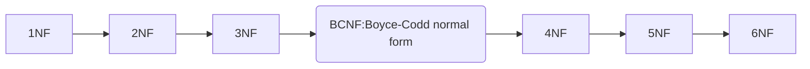

#DATABASES 

## Why Normalization? 

Normalization became important to reduce data redundancy because in the past, in 1956 there weren't 1GB disk drive. A disk has a capacity of 3.75 MB. 

When the first relational databases appeared, it was more important to make a good use of the space. 

Nowadays, with no-relational databases or NoSQL, this type of databases take advantage of data redundancy

### Normalization

Normalization is the process of structuring a relational database, in accordance to a set of rules called normal forms in order to reduce data redundancy and improve data integrity

* Data redundancy: information should not de duplicated. For example: if 
		Students(id, name, ZipCode, City)
		You can have various students living in the same `City` and same `ZipCode`. For avoiding this, separate City and ZipCode into another data entity in the database diagram. 
* Data Integrity: With no duplicated data, updates only modify a value once. 

### Normal Forms

There exists so much normalization rules classified and grouped by Normal Forms. 

The normal forms are consecutively grouped, meaning that for meeting 3NF, 2NF and 1NF needs to be fullfiled. 

If a database meets the three first normal forms (1NF, 2NF and 3NF) its considered as normalized. 

###### 1º Normal Form

Must fullfil the following rules: 
* None of the attributes has more than 1 value. 
* If an attribute is present in different tables, it must have the same data type
* Attributes names are unique, cannot be more than 1 with the same name. 
* Order of tuples doesn't matter. 

###### 2º Normal Form

Satisfy 1NF and the following rules: 
*  It must not have any partial relation-ships. 

Partial dependency or relation-ship is the relation of an attribute with another attribute that is not the primary key. 

In the following example, the entire relation-ship is splitted up into two different relation-ships that involve the `primary key`. 

![[normalization-partial-dependency.png|400]]

###### 3º Normal Form

Satisfy 2NF and follow the next rules: 
* It must not have any transitive dependency: 

Transitive dependency: transitivity in databases means that one attribute A imply a B attribute and B attribute also imply a third one. In this case, the relation may be splitted up into two relations. 

