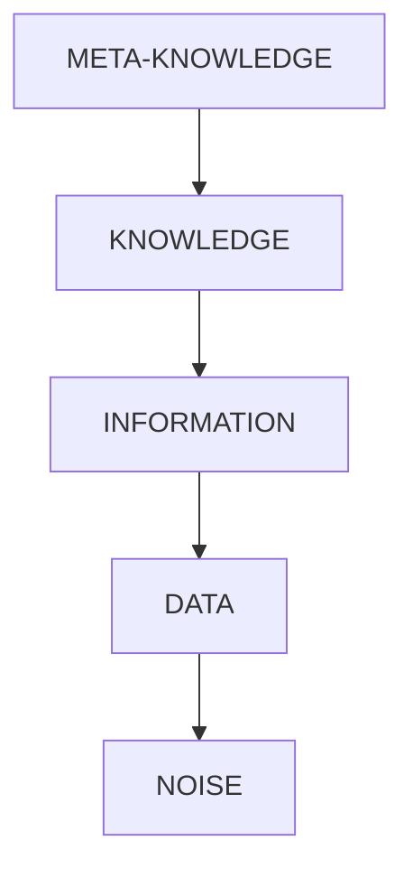

#ML 

Knowledge is the condition of knowing something with familiarity gained through association or experience.

In Knowledge representation [[KR - Knowledge Representation]] of machine learning and artificial intelligence, Its Knowledge the dataset in a structured manner that model the expericne you hace in certain domain or that merges from interpreting data

#### Types of knowledge in Artificial Inteligence

* a priori knowledge
	* Comes before knowledge percieved through senses
	* Considered universally true
* a posteriori knowledge
	* knowledge verifiable through the senses
	* may not always be reliable
* procedural knowledge
	* knowing how to do something
* declarative knowledge
	* knowing something is true or false
* tacit knowledge
	* knowledge not easily expressed by language

#### Hierarchy of Knowledge

From most valuable and relevant knowledge to less: 

| Type of knowledge           | Definition                                           |
|----------------|------------------------------------------------------|
| `Meta-knowledge` | Knowledge about knowledge and experience             |
| `Knowledge`      | Specialized information that is useful              |
| `Information`    | Processed data that are of interest                 |
| `Data`           | Items of interest                                    |
| `Noise`          | Elements of little interest and hiding data          |

Its information to the core data set, without interpreting, wich are used as input to the system.
* numerical information
* sensor data or similar
* etc

Its Knowledge the dataset in a structured manner that model the expericne you hace in certain domain or that merges from interpreting data: 
* Interpretation of values from a test or dataset
* Set of data structure or methods to do a certain things from the interpretation of some values and data

Can be structured into:

$Knowledge = information + interpretation$

And the knowledge must allow lead the mechanism of IA to obtain a more efficient solution. 

