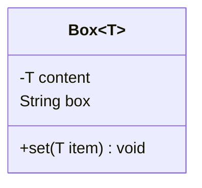
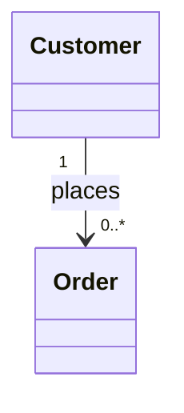
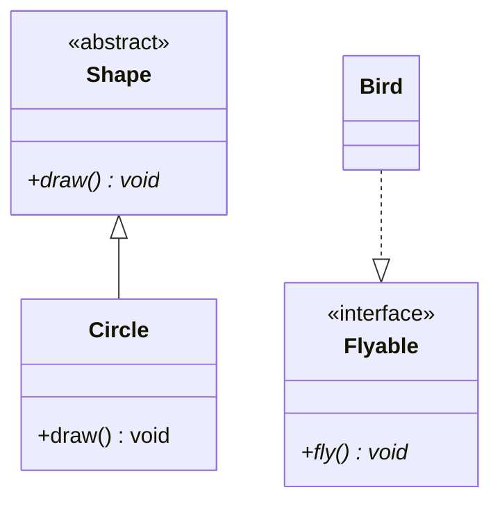
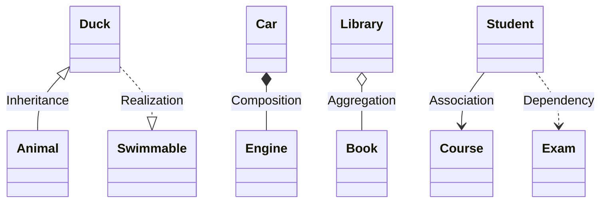
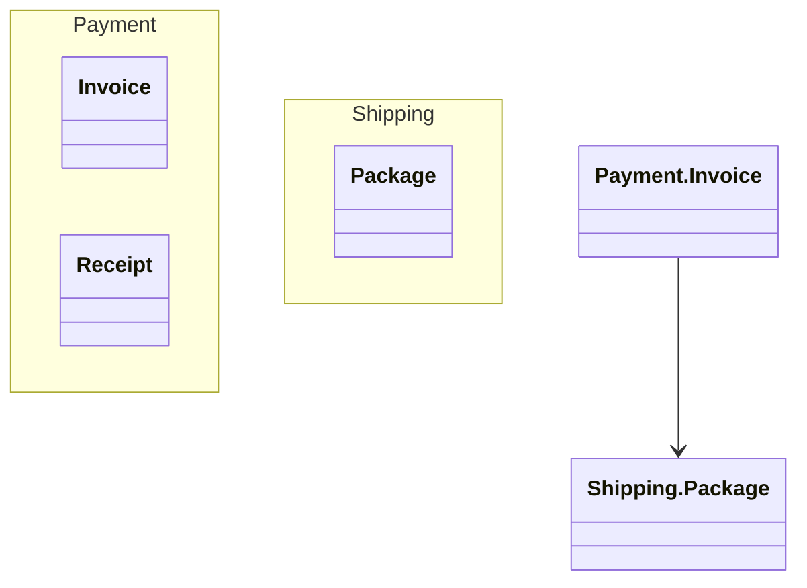
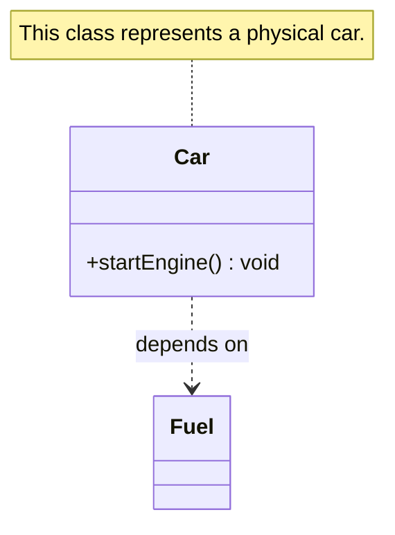

#MERMAID


Class diagrams are one of the most used UML  

### Class definition

```txt
classDiagram
    class BankAccount {
        -String owner
        -double balance
        +deposit(amount double) void
        +withdraw(amount double) boolean
    }
```

With member accesibility: 
- `+` = Public
- `-` = Private
- `#` = Protected
- `~` = Package/Internal

```mermaid

```

### Templates or generic classes

The `<` and `>` symbols need to be delimited as `~`. So in order to make generic classes it will be written like this:
```txt
classDiagram
    class Box~T~ {
        -T content
        +set(T item) void
    }
    Box~String~ : String box
```

And will render like this: 


### Cardinality

Cardinality or Multiplicity is written like this: 

```txt
classDiagram
    Customer "1" --> "0..*" Order : places
```

And each one of the cardinality factors is placed next to the class and arrow join. 


Different cardinalities
- `1` → Exactly one
- `0..1` → Zero or one
- `*` or `0..*` → Many
- `1..*` → One or more

### Class modifiers

In mermaid, class modifiers are placed at the start of a class description: 
```txt
classDiagram
    class Shape {
        <<abstract>>
        +draw()* void
    }
    class Circle {
        +draw() void
    }
    Shape <|-- Circle
    class Flyable {
        <<interface>>
        +fly()* void
    }
    Bird ..|> Flyable
```

And it will look like this: 


- `<<abstract>>` or italicized class name (`Shape`).
- `<<interface>>` for interfaces.
- `<<enumeration>>` for enums
- `*` after method = abstract method.

## Relationships

| UML Relationship  | Meaning                                                                 | Mermaid Syntax | Symbol (Mermaid)          |
| ----------------- | ----------------------------------------------------------------------- | -------------- | ------------------------- |
| **Inheritance**   | A child class extends a parent class (Generalization).                  | `<--`          | ◄-- (Hollow Arrow)        |
| **Composition**   | Strong "whole-part" relationship (part cannot exist without the whole). | `*--`          | ◆-- (Filled Diamond)      |
| **Aggregation**   | Weak "whole-part" relationship (part can exist independently).          | `o--`          | ◇-- (Empty Diamond)       |
| **Association**   | A directional relationship (e.g., "uses" or "knows about").             | `-->`          | --> (Solid Arrow)         |
| **Link (Solid)**  | Simple connection (no direction implied).                               | `--`           | -- (Solid Line)           |
| **Dependency**    | Temporary "uses" relationship (e.g., method parameter).                 | `..>`          | ..> (Dashed Arrow)        |
| **Realization**   | A class implements an interface.                                        | `..>`          | ..► (Dashed Hollow Arrow) |
| **Link (Dashed)** | Informal or indirect relationship.                                      | `..`           | .. (Dashed Line)          |

Key differences between different types of Relationships: 

* Composition vs. Aggregation:

	* Composition (*--) implies ownership (e.g., Car owns an Engine; if Car dies, Engine dies).
	* Aggregation (o--) implies sharing (e.g., Library has Books, but books can exist without the library).

* Association vs. Dependency:

	* Association (-->) is a stronger, long-term relationship (e.g., Student --> Course).
	* Dependency (..>) is temporary (e.g., Report depends on a Database for a query).

* Realization: Used for interfaces (e.g., class ..|> interface).




### Namespaces

namespaces need to be defined similar as a class and contain between brackets the classes that belong to that namespace: 
```txt
classDiagram
    namespace Payment {
        class Invoice
        class Receipt
    }
    namespace Shipping {
        class Package
    }
    Payment.Invoice --> Shipping.Package
```

It will look like this: 


### Notes

You can attach a note into a class using "note for {class}": 
```txt
classDiagram
    class Car {
        +startEngine() void
    }
    note for Car "This class represents a physical car."
    Car ..> Fuel : depends on
```

And wil look like this:


