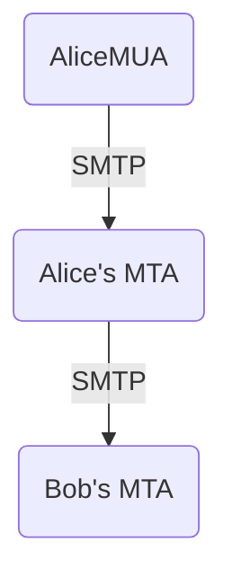

#NETWORKING 

### OVERVIEW

In email sending use the combination of 3 different protocols: 
* [[SMTP]]
* [[POP3]]
* [[IMAP]]

![[overview_email_protocols.png|250]]

### EMAIL SENDING STRUCTURE

In order to send an email and be received or retreievd from a server by other device, it goes through certain elements in the network to make this delivery. 

It has 4 key elements: 

* `MUA` Mail User Agent:

Used by humans. 
Compose, read and send emails
Uses SMTP to push emails to MTAs and POP3 or IMAP to fetch the emails. 
Can be desktop-based or web-based

* `MTA` Mail Transfer Agent

Stores email, mailboxes, and handles authentication
Receives emails from MUAs and dispatches them between Mail Servers. 
Acts as both, client and server. 

* `SMTP` Simple Mail Transfer Protocol
Applicacation Layer protocol 
Communication protocol used between MUAs and MTAs

* `IMF` Email Messages

This mail messages composed of a body (email itself) and a headers that add metadata ro the message. 
They are added by MUA or MTA. 

| Header           | Created by  | Comments              |
| ---------------- | ----------- | --------------------- |
| Subject          | MUA         |                       |
| From             | MUA         | Mandatory             |
| Reply-To         | MUA         |                       |
| To               | MUA         | Mandatory without BCC |
| CC (Carbon Copy) | MUA         |                       |
| BCC (Blind CC)   | MUA         | Mandatory without To  |
| Date             | First MTA   | Mandatory             |
| Received         | All the MTA |                       |
| Return-Path      | Last MTA    |                       |
| Message-ID       | All MTA     |                       |
 Headers and body are separated by a blank line. 
 

### EPILOGUE

Management of an email infraestructure is very hard
* Spam prevention mechanisms make imposible to host your own mailing solution
* An SMTP server demands very high availability
* Its way easier to rely on cloud-based solutions such as Gmail or yahoo
