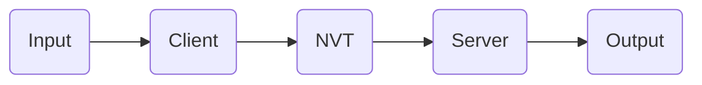

#NETWORKING 

## TELNET

Telnet is a protocol that allows a client-server connection over a TCP/IP [[TPC - IP Layers]] network. 

Its used to: 

* Connect from a client to a server and use this last one as a terminal. 
* **Encode the data** between the client and the server. 
* Facilitate the negotiation and use of options. 

Is built over three important concepts: 

* The Network Virtual terminal (NVT)
* Symmetric operation
* Options and Option Negotiation. 

It uses port 23. 

##### NETWORK VIRTUAL TERMINAL `NVT`

Telnet defines an standardized, fictional terminal called the Network Virtual Terminal. NVT was defined as a NVT ASCII of 7 bits that is sent as a 8-bit byte [[ASCII]].  

Telnet stardard specify that both device must accept the ASCII printable codes and have at least this three avaliable (0, 10, 13): 

![[./IMAGES/ascii-nvt-control-codes.png]]

This Virtualized terminal allow universal communication over different terminals as well as the duplex mode. [[TELNET - Duplex mode]]. 

Its done this way because Client and Server can differ in many ways: 

* type of keystroke (text representation format)
* keystrokes that can be sent
* number of characters per line or event lines in a screen in the terminal. 
* character set used to encode data or functions. 

By using this standardized format of communication, the NVT define a set of rules: 

* How information is formatted and sent: 
	* character set 
	* line termination
* how telnet information is sent

It follows different steps: 

* Client translated user input into NVT format. 
* Client send this format into Server running in a host. 
* Server translates the NVT received into the representation it understands or requires. 

##### OPTION NEGOTIATION

When they need to use a more complex or advanced communication they use a certain set of options being handled via a negotiation system. 

Telnet protocol define a set of options and a mechanism through the devices can negotiate each option usage. 

`Enable options using negotiation`

If both agree an option, it can be enabled. 

Either device may choose to initiate the use of an option or asks to enable / use the option with the parameters send. 

* `WILL <option>` It wants to start using the specific option. 
* `DO <option>` It want the other device to start using the option. 

The responding device may either agree or disagree responding with the contrary negotiation response and specifying the option accepted or denied. 

The set of options can be seen in the following document: [[TELNET - Commands]]. 

##### SYMMETRIC OPERATION

Once telnet session between client and server is stablished, they can send and receive data as equals. 

Telnet uses in-band signaling in both directions, so commands are sent through the same channel as the data 

