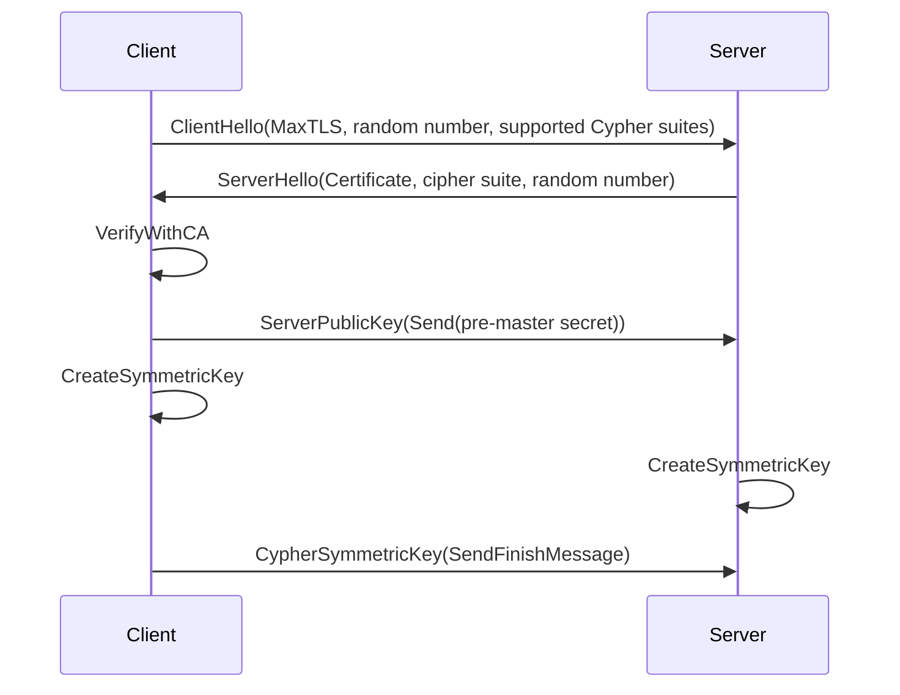

#NETWORKING 

# TLS - Transport Layer Security

TLS or Transport Layer Security is a session layer protocol that keeps the communication private, unaltered, interoperable and efficient. 

This protocol establish an agreement between communication peers by the use of public and a private key that secure the connection by the use of Cryptographic measures. 

* Cryptographic security: Establishes a secure connection between two parties providing C and I of CIA Triad.
* Interoperability: Independent developers can use it in their independent frameworks
* Extensibility: TSL can be extended new public key and bulk encryption methods preventing the need to create new protocols or security libraries. 
* Relative efficiency: TSL 1.2 negotiates the connection in two RTTs and TSL 1.3 in just one RTTs $^1$

### HOW DOES IT WORKS? 

It has two modes of message encryption and keys exchange: 

##### SYMMETRIC CRYPTOGRAPHY

Uses the same public key to both actions: encryption and decryption. 
Example: DES, 3DES and AES cryptographic algorithms. 

![[./IMAGES/symmetric_cryptography_tls.png|350]]

##### ASYMETRIC CRYPTOGRAPHY

Cryptographic algorithms uses two keys, a public key and a private key. 

This keys are generated in **pairs** and a message ciphered with the public key can only be decrypted with the paired private key and viceversa. 

This duality can proof someones identity and works as a digital signature. 

### TLS Handshake

Client sends a `ClientHello` message to server
* Specifies max TLS version, a random number and supported cipher suites. 

Server answers with `ServerHello` message
* Includes server's certificate and the selected cipher suite and a random number. 

Client verify the server's certificate with a **trusted CA**. This certificate contains Server public key

Client sends the pre-master secret ciphered with server's public key. 

Client and Server create the same symmetric key by mixing the pre-master secret and random numbers sent before. 

Both send a finish message ciphered by the symmetric key. 

Rest of TCP communication is ciphered with this symmetric key. 

As a summary: 

* Symmetric cryptography is used to secure the TCP connection because is more efficient. 
* In order to share the symmetric key, the obtention is done in both sides with the same previously shared random numbers and pre-master secret. Symmetric keys never travel over internet. 
* Asymmetric cryptography is used to do this random number exchange. 

### CA - Certificate Authority

The certificate authority is some well-know institutions or tech companies that signs, issues and verificates certificates for other actors. 

#### THE CIA TRIAD

The most wanted features for communications are: 

* **Confidentiality**: The contents of the communication remain private. 
* **Integrity**: The contents of the communication remain unaltered. 
* **Availability**: The receiver of the communication has access to it.

---
$^1$ RTT: Round trip time: time to send a request and get the response taking into account propagation times, delay queuing and routers. 